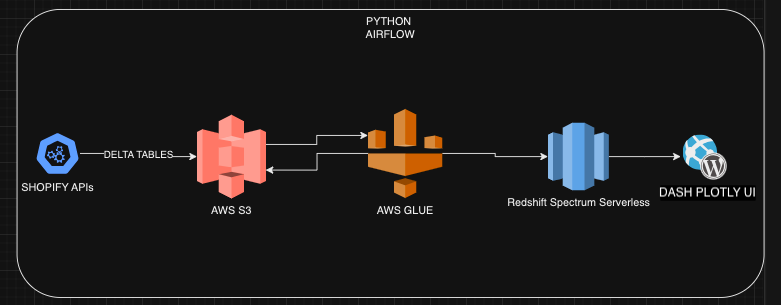
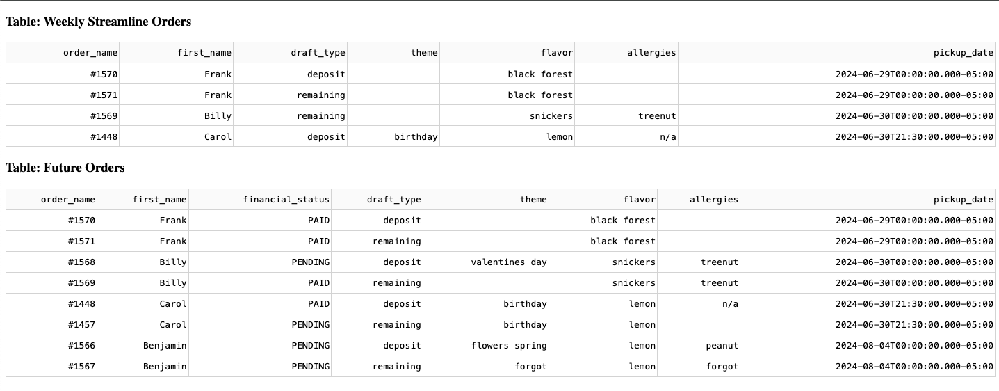

# The Story

My wife owns a business Bake My Day Organic Bakery (organicbakeryaustin.com), she bake custom cakes for events in Austin,Texas. I have built the platforms for her to sell and display her products in Shopify. My purpose is to build pipelines to run analytics on the business's orders data. This data will come through Shopify GraphQL APIs, and analyzed in AWS platform. Currently, we have a static website in S3 to see orders details, that is using API Gateways to trigger AWS Lambda functions. This is the repo (https://github.com/yvznmn/bake_my_day_modules) for that analytics we have in prod which is not efficient. For example, the amount of computing we are performing in APIs, is timing out in API Gateway because it takes more than 35 sec, which is higher than max threshold, and it is not the best practice. It is better that all this calculations are done in daily basis and UI should read the ready table. Like this, i want to run more complex calculations and I need this project for this.

# The Problem

**Main Problem:** We cant make analytical calculations with API Lambda functions. I want to run complex analytics on the data, so I need to create a data warehouse and built data pipelines on top of it.

**Problem 1:** We have cake orders that needs to be handled to customer in certain date(event_datetime) after the conversation we are having customer. Shopify provides metafields to give custom details to the orders, and we are using it event_datetime type of details about the order. The problem is we do not know in which sequence we should bake the cakes in that week. For example, one time, my wife forgot to bake a cake that needs to be delivered for the next day. If she had this system, she would not miss it. It is extremely time consuming and error-prone for us to go to each upcoming orders and figure out the order of the cakes. Here is the requirements:
1) We have one deposit and one remaining balance(2 Shopify Orders per request) for each customer request. Either one of them, should be PAID, so we can start baking the cake.
2) We want to see the details of the orders, so we know what we are baking.
3) We want to see the customer requests in a table in ascendig order, so that we can see which orders we should work on.
4) We only want to see this weeks cake requests.

**Problem 2:** The problem is we want to see all the future orders, so that we can plan our personal time offs, and have control over the amount of work we are expecting. This is also beneficial, to see if we are missing anything for the orders we are creating. Here is the requirements:
1) For each customer request, we should see 2 records, one for deposit, and one for remaining. If we dont see, this means, we should create the missing one.
2) We want to see all orders either PAID or UNPAID.
3) We want to see event_datetime field as ascending order.

# Tech Stack

Python for everything.
Shopify to visualize business needs.
Shopify GraphQL APIs to generate, and retrive data from Shopify Development Environment.
Delta Tables to have ACID Data Warehouse.
AWS S3 to store Delta tables.
AWS Redshift Spectrum Serverless as my Data Warehouse, so I can query and run queries.
AWS Glue to keep metadata and update tables data accordingly in AWS Redshift Spectrum Serverless.
Airflow to orchestrate, schedule and run ETL pipelines.
Postrgres to store Airflow Data.
Dash Plotly to visualize the data in Dash Tables.

# Conceptual Data Modeling

# Design

# Common Commands and Details

python3 -m venv venv
source venv/bin/activate

pip install pyspark==3.2.1
pip install delta-spark==1.2.1

export PYTHONPATH="${PYTHONPATH}:<YOUR_PROJECT_ROOT>"
export AWS_ACCESS_KEY_ID=<AWS_ACCESS_KEY_ID>
export AWS_SECRET_KEY=<AWS_SECRET_ACCESS_KEY>

**In order to generate data**
cd test_data
python -c "from generate_data import <function_name>; <function_name>(<params_if_any>)"

**Create your DW**
provide necessary security inbound rules for the REdshift port and proper IP
provide necessary VPC Network ACL inbound rules for the REdshift port and proper IP

**AWS Redshift Spectrum Serverless**

CREATE SCHEMA IF NOT EXISTS <schema_name>;
export AIRFLOW_HOME=<airflow_home>
airflow db init
airflow users create \
   --username admin \
   --firstname FIRST_NAME \
   --lastname LAST_NAME \
   --role Admin \
   --email admin@example.com

**Airflow**
brew install postgresql
brew services start postgresql@14
# Open the db
psql postgres
CREATE ROLE <USER_NAME> WITH LOGIN PASSWORD '<PWD>';
ALTER ROLE <USER_NAME> CREATEDB;
\q 
psql postgres -U admin
CREATE DATABASE airflow;
GRANT ALL PRIVILEGES ON DATABASE airflow TO <USER_NAME>;
\q
brew services stop postgresql@14
pip install 'apache-airflow[postgres]'

nohup airflow webserver -D &
pkill -f "airflow scheduler"
pkill -f "airflow webserver"
nohup airflow scheduler &
ps aux | grep airflow

# Final Output
